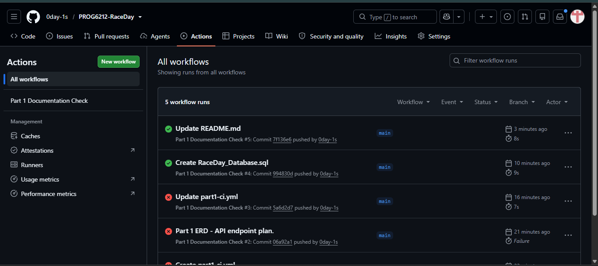

# RaceDay Event Management System

## Project Description
RaceDay is a full-stack, web-based event management system built for the South African road running, walking, and cycling community. The platform allows Event Organisers to create and manage events, categories, and participant results, while Participants can browse upcoming events, enter events, and track their personal performance history.

This repository contains the Portfolio of Evidence (PoE) for PROG6212 (Programming 2B), submitted in three parts:
- **Part 1** — System planning: ERD, API endpoint plan, SQL database script.

## User Roles

### Organiser
Can create, edit, and delete events, manage event categories, capture participant results, and view all enrolments for their events.

### Participant
Can create an account, browse events, enter an event by selecting a category, view their own enrolments, and track their personal race results.

## Part 1 — System Planning and Database
Located in `/docs`:
- `RaceDay_ERD.pdf` — Entity Relationship Diagram (6 entities: Users, Venues, Events, Categories, Enrolments, Results), showing primary keys, foreign keys, and relationship cardinality.
- `RaceDay_API_Endpoint_Plan.md` — Full API endpoint plan covering Authentication, User Profile, Events, Categories, Event Enrolments, and Results.
- `RaceDay_Database.sql` — SQL Server script creating the full schema with constraints and realistic seed data.

## Database Setup
1. Open SQL Server Management Studio (or Visual Studio's SQL Server query tool) and connect to a SQL Server instance.
2. Open `docs/RaceDay_Database.sql`.
3. Execute the entire script (F5). It will create all six tables (Users, Venues, Events, Categories, Enrolments, Results) with primary keys, foreign keys, and constraints, then seed the database with sample Organisers, Participants, Events, Categories, Enrolments, and Results.
4. Confirm the tables and seed data by expanding the database in Object Explorer or running a `SELECT * FROM dbo.Users;`.

## CI/CD
A GitHub Actions workflow (`.github/workflows/part1-ci.yml`) validates the repository structure on every push — checking that the `docs` folder exists and contains the ERD, API endpoint plan, and SQL script, and that this README is present.

**Successful green build:**

   

## Video Demonstration
 YouTube link: 
